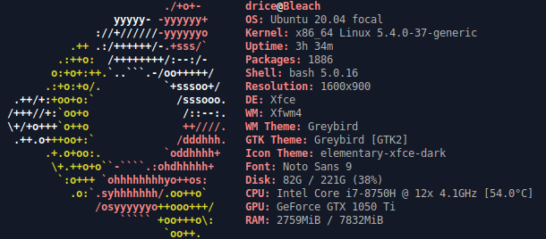
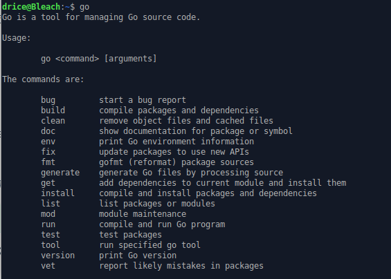
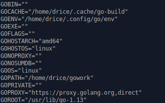
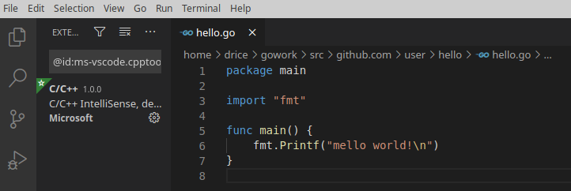
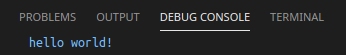
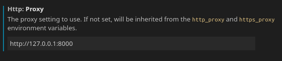
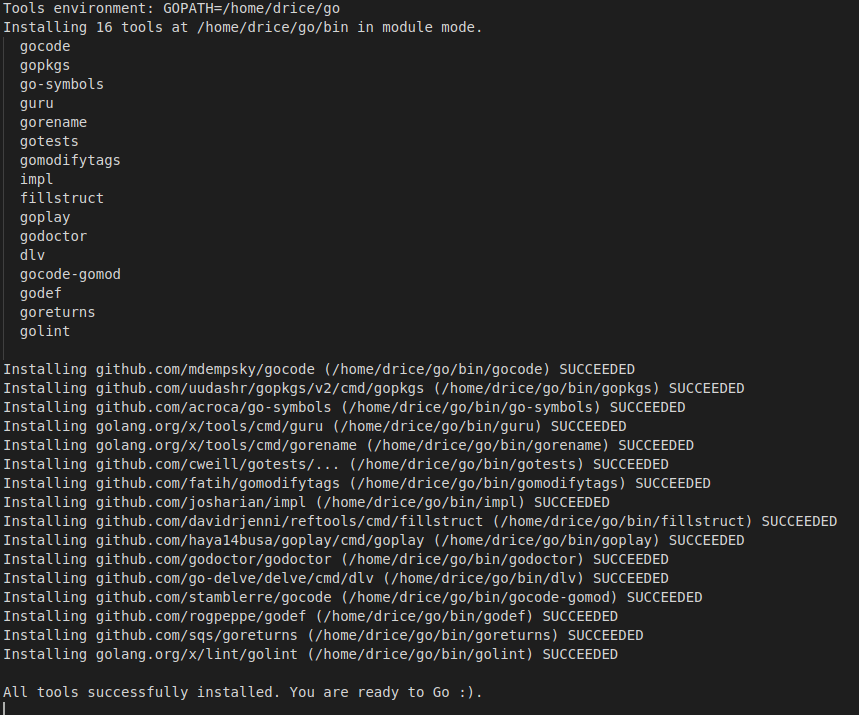
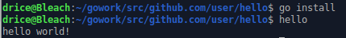

18342010 陈星辉

实验环境:

ubuntu20.04

1.安装vscode

在官网下载包到本地, 进行安装

2.安装golang

ubuntu下可以直接使用apt install

完成后在命令行输入go, 结果如下

3.设置环境变量

按照老师给出的指令逐条复制运行, 完成后输入go env检查

3.5.创建运行hello world

代码:

运行结果:

4.安装git

本机已有git, 跳过

4.5.安装go的一些工具

由于众所周知的原因, vscode无法正常下载国外的一些扩展插件。但是挂上代理之后就可以正常下载了。

挂代理:

一键安装:

5.安装go tour

由于可以使用https://tour.go-zh.org/list 在线阅读go tour, 因此并没有选择安装到本地。

6.我的第一个包和测试

测试完毕

