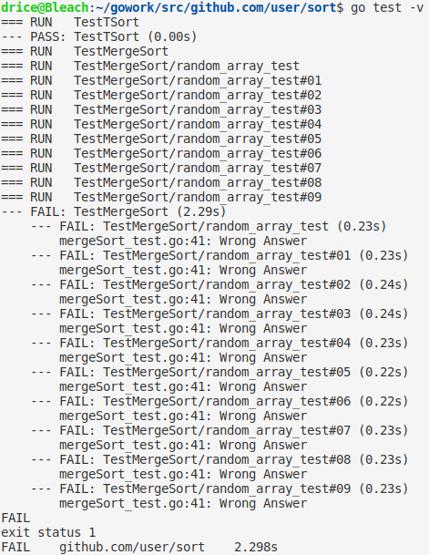
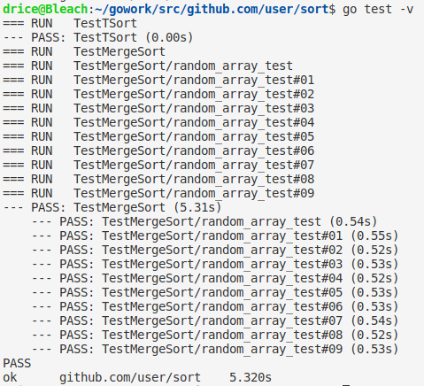
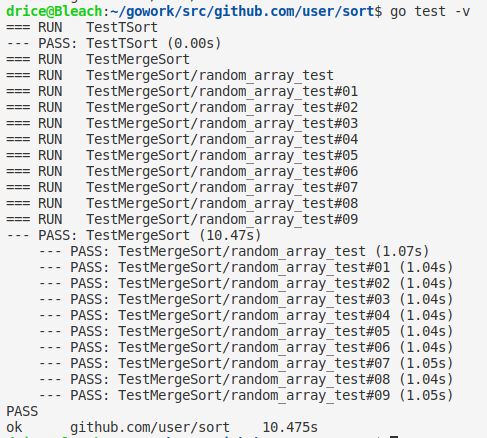

# 归并排序算法的实现和测试

* 归并排序是一个大家都熟悉的算法, 此处不赘述其具体细节。
* 简单地说, 它能对无序数组进行排序。时间复杂, 空间复杂度, 需要与原数组长度相同的辅助空间。
## 实现代码

<pre><code>
func mergeSort(a []int, l int, r int) {
	if l < r {
		mid := (l + r) / 2
		mergeSort(a, l, mid)
		mergeSort(a, mid+1, r)
		t := make([]int, r-l+1)
		pl := l
		pr := mid + 1
		for i := l; i <= r; i++ {
			if pl <= mid && (pr > r || a[pl] < a[pr]) {
				t[i-l] = a[pl]
				pl++
			} else {
				t[i-l] = a[pr]
				pr++
			}
		}
		for i := l; i <= r; i++ {
			a[i] = t[i-l]
		}
	}
}
func mySort(a []int) {
    mergeSort(a, 0, len(a)-1)
}
</code></pre>
## 测试代码

* 每次运行十个测试, 每个测试中先用rand生成一个随机长度, 元素随机的整数数组, 用归并排序对其进行排序, 把得到的结果和go语言sort库中sort.Ints()排序的结果进行比对, 如果完全相同则测试通过。
<pre><code>
func TestMergeSort(t *testing.T) {
	rand.Seed(time.Now().UTC().UnixNano())
	testCase := 10
	testLength := 500000
	for rnd := 0; rnd < testCase; rnd++ {
		t.Run("random array test", func(t *testing.T) {
			length := testLength
			got := make([]int, length)
			want := make([]int, length)
			for i := 0; i < length; i++ {
				got[i] = rand.Intn(100)
				want[i] = got[i]
			}
			mySort(got)
			sort.Ints(want)
			if isEqual(got, want) == false {
				t.Errorf("Wrong Answer")
			}
		})
	}
}
</code></pre>

## 测试结果

* 不进行排序, 只进行测试, 显然是不能通过的

* 

  

* 正确调用mySort()之后, 进行测试, 可以通过

* 

  

* 对其性能进行检验, 当 n = 1000000时单次排序约1s, 效率和sort.Ints()相当

* 
